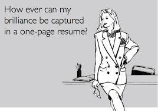
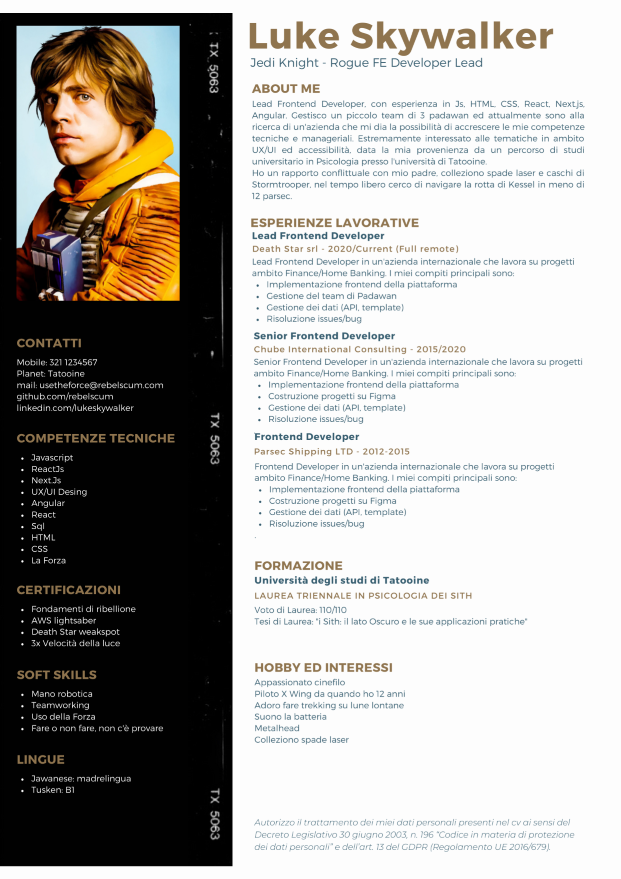

# Guida Galattica per il CV
*Nota bene, anzi nota BENISSIMO! Questa Guida è incentrata sulla costruzione di un CV adatto al mercato del lavoro IT italiano. Successivamente, l'obiettivo è far crescere il progetto e scrivere guide anche in altre lingue e modificare le indicazioni, adattandole ad altre nazioni e relativi mercati.*

## Indice
  1. [Indicazioni Generali](#1-indicazioni-generali)
  2. [La Foto](#2-la-foto)
  3. [I Contatti](#3-i-contatti)
  4. [L'About me](#4-labout-me)
  5. [Le Esperienze Professionali](#5-le-esperienze-professionali)
  6. [La formazione](#6-la-formazione)
  7. [Le competenze tecniche](#7-le-competenze-tecniche)
  8. [Le soft skills](#8-le-soft-skills)
  9. [Corsi e certificazioni](#9-corsi-e-certificazioni)
  10. [Lingue ed hobby](#10-lingue-ed-hobby)
  11. [L'autorizzazione al trattamento dati](#11-lautorizzazione-al-trattamento-dati)
  12. [Considerazioni Finali](#12-considerazioni-finali)

## Indicazioni Generali

Partiamo da un assunto fondamentale: il CV PERFETTO non esiste, così come non esiste "il CV a prova di ATS". 
Le indicazioni che ti darò in questo progetto saranno di tipo sia tecnico/qualitativo/estetico, per darti la possibilità di costruire un CV funzionale, contenente il giusto mix di parole chiave, descrizione delle esperienze professionali, soft skill e molto altro.
Alcune tips utili prima di iniziare: 
  

  
- E' bene cercare di costruire il CV di una sola pagina (un recruiter esperto ci mette 10-20 secondi per leggerne uno) per catturare subito l'interesse e l'attenzione di chi riceverà il documento. Content is king, ma anche l'occhio vuole la sua parte!
- Come vedrete nell'esempio di CV in basso, redatto appositamente per questo progetto (sì, adoro Star Wars, si nota?), il CV dovrebbe essere sintetico ma esaustivo, contenente tutte le keyword necessarie per la posizione per la quale state applicando
- consiglio VIVAMENTE di non utilizzare il formato Europass, ormai datato e senza alcuna possibilità di personalizzazione grafica (il CV di esempio l'ho creato su <a href="https://www.canva.com/">Canva</a>, che contiene centinaia di template validi, ma potreste usare anche <a href="https://www.latextemplates.com/">LaTeX</a> o anche <a href="https://www.overleaf.com/">OverLeaf</a>)

Ecco un esempio di CV che ho creato appositamente. Ho scelto un template esteticamente molto minimal ma che, a mio avviso funziona.

## 2) La foto
Riguardo l'annosa questione "ma la foto la metto o no nel CV?" la risposta che fornisco sempre è "fai come te pare". Ma, TI PREGO, se decidi di inserirla ricorda alcune semplici regole:
- preferibile una foto a mezzo busto, fatta in modo professionale e dove sei ritratto di fronte
- EVITA foto sgranate o molto vecchie
- EVITA foto che ti ritraggono al mare, ad una festa, con cocktail/cagnolini/gattini/cose in mano
- EVITA foto che sono evidentemente foto di gruppo che hai ritagliato (male)
- EVITA foto ammiccanti, con vestiti succinti o provocanti. E' un CV, non un book per fare il/la modello/a.
- Se non hai una tua foto professionale, va bene anche un avatar/illustrazione di te stesso (sei pur sempre un dev, un minimo di creatività va bene), ma cerca di tenerti sempre nei limiti del professionale

C'è anche un dibattito riguardo il quale eliminando la foto si eliminerebbero dei bias inconsci su sesso, etnia, tratti somatici particolari e così via. Sono parzialmente d'accordo con questa filosofia, anche se comunque i bias ed i pregiudizi possono nascere da una moltitudine di cose (ad esempio: ti chiami Mario? Io ODIO chi si chiama Mario e ti scarto il CV) quindi ecco, eliminare la foto potrebbe eliminare una parte di bias riguardo "l'estetica" ma non li elimina tutti.
Ergo, la scelta di inserire o meno la foto nel CV è molto personale e non ha una regola definita. Sta a voi, ma basta seguire le indicazioni di cui sopra.

## 3) I Contatti

Che tu ci creda o no, ricevo un sacco di CV senza, ad esempio, l'indirizzo mail e/o il numero di cellulare. FOLLIA! 
Occhio alla sezione contatti, perché è FONDAMENTALE. Di grazia, se non abbiamo il tuo numero di telefono o la tua mail come ti contattiamo? Piccione viaggiatore?
Anche qui, alcune semplici regole:
- Ricorda di inserire tutti i contatti utili, come nel CV di esempio
- scegli un indirizzo mail professionale (evitiamo le mail tipo diavoletto88 oppure bananakiller83)
- inserisci i link del tuo profilo Linkedin, Github (e se hai portfolio online anche di quello). Rendi questi link cliccabili per agevolare chi legge il tuo CV ad una rapida apertura del link senza dover fare copia-incolla ogni volta.

## 4) L'about me

  Questa sezione del CV è a dir poco FONDAMENTALE. Ti permetterà di riassumere in poche righe la tua esperienza professionale, le tecnologie/linguaggi che conosci o che stai approfondendo, i tuoi obiettivi lavorativi e personali e potresti anche fornire qualche spunto "extra" relativo magari a dei progetti personali che segui nel tempo libero, hobbies o altro che a tuo avviso potrebbe essere interessante. 
  L'about me è una delle prime cose che chi valuta CV legge e permette di avere una prima overview di chi sei, cosa hai fatto e soprattutto cosa cerchi nel tuo futuro professionale. Nel CV di esempio di Luke potrai notare che l'about me ha sostanzialmente tutti gli elementi necessari: il job title attuale, le tecnologie/linguaggi che Luke conosce, segnala che gestisce un team di junior, scrive cosa cerca per il futuro. Inoltre, parla del suo interesse verso altre tematiche tecniche collegate al ruolo di FE ed infine fornisce una overview del suo tempo libero e dei suoi hobbies, che come vedremo nel paragrafo dedicato sono uno strumento interessante per un gancio di conversazione con chi dovrà valutarti.

## 5) Le esperienze professionali

  Ovviamente le esperienze professionali sono il cuore di tutto il CV: in questa sezione l'obiettivo è di essere sintetici ma esaustivi nel raccontare cosa hai fatto nel tuo percorso professionale e valorizzare i progetti più rilevanti, le tecnologie utilizzate e molto altro. Nell'esempio del CV di Luke noterai una certa standardizzazione del layout, questo perché il CV costruito in questo modo risulterà più leggibile, più snello ma allo stesso tempo completo di tutte le info utili, come ad esempio:
  - date di inizio e fine esperienza professionale, complete del nome dell'azienda
  - Una crescita professionale coerente: nel cv di esempio il buon Luke inizia nel 2012 come FE Dev per poi crescere come Senior FE per poi arrivare all'ultima esperienza come Team Lead. Questa crescita professionale coerente salta all'occhio di un recruiter/selezionatore esperto e fornisce un'overview
  - bullet point che descrivono sinteticamente ma in maniera efficace le mansioni principali, i progetti seguiti, le tecnologie utilizzate

## 6) La formazione
Lorem ipsum dolor sit amet.

## 7) Le competenze tecniche
Lorem ipsum dolor sit amet.

## 8) Le soft skills
Lorem ipsum dolor sit amet.

## 9) Corsi e certificazioni
Lorem ipsum dolor sit amet.

## 10) Lingue ed hobby
Lorem ipsum dolor sit amet.

## 11) L'autorizzazione al trattamento dati
Lorem ipsum dolor sit amet.

## 12) Considerazioni finali
Lorem ipsum dolor sit amet.
